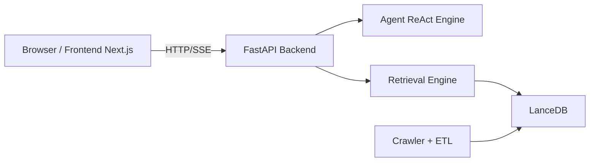

# SEU-WuHub

> Intelligent Information Service System Based on Multi‑Source Data Integration

[English](README.en.md) | [中文](README.md)

<p align="center">
  
</p>

[](backend/pyproject.toml)
[](backend/pyproject.toml)
[](frontend/package.json)
[](frontend/package.json)
[](backend/pyproject.toml)
[](backend/pyproject.toml)
[](docs/ARCHITECTURE.md)
[](docs/backend/api.md)

SEU-WuHub aggregates campus announcements from multiple sources (for example, the Academic Affairs Office and Library) and provides natural-language question answering powered by hybrid retrieval and a ReAct agent.

## Highlights

- Multi-source ingestion: Config-driven crawler pipelines with YAML-first onboarding.
- Hybrid retrieval: Vector retrieval plus full-text retrieval for both semantic and keyword matching.
- Agent QA: ReAct workflow with tool invocation and streaming responses.
- Realtime UX: SSE-based incremental answer rendering.
- Unified storage: LanceDB stores structured data, vector indexes, and full-text indexes together.

## Architecture Overview



- Architecture details: [docs/ARCHITECTURE.md](docs/ARCHITECTURE.md)
- Technical narrative: [docs/TECHNICAL_NARRATIVE.md](docs/TECHNICAL_NARRATIVE.md)
- Module integration: [docs/MODULE_INTEGRATION.md](docs/MODULE_INTEGRATION.md)

## Project Structure

```text
SEU-WuHub/
├── backend/      # FastAPI + Agent + Retrieval + Ingestion
├── frontend/     # Next.js App Router frontend
├── config/       # Global configs (tags, websites, etc.)
├── docs/         # Architecture and module docs
├── scripts/      # Ops and utility scripts
├── data/         # LanceDB data directory
└── docker-compose.yml
```

## Quick Start

### 1. Requirements

- Python 3.13+
- Node.js 22+
- Docker / Docker Compose (optional)
- Recommended: [uv](https://docs.astral.sh/uv/)

### 2. Local Development (Recommended)

1. Install backend dependencies

```bash
make backend-install
```

2. Install frontend dependencies

```bash
make frontend-install
```

3. Start backend (default port 8000)

```bash
make backend-dev
```

4. Start frontend (default port 3000)

```bash
make frontend-dev
```

Access:

- Frontend: http://localhost:3000
- Backend: http://localhost:8000
- OpenAPI: http://localhost:8000/docs

### 3. Start with Docker

```bash
make docker-up
```

Stop services:

```bash
make docker-down
```

## Common Commands

```bash
# Code quality
make lint
make format
make typecheck
make security

# Tests
make backend-test
make frontend-test
make test
```

## API Overview

Primary endpoints (subject to implementation):

- `GET /api/v1/articles`
- `GET /api/v1/articles/{id}`
- `GET /api/v1/search`
- `POST /api/v1/search`
- `GET /api/v1/metadata`
- `POST /api/v1/chat/stream`
- `POST /api/v1/chat/title`
- `GET /health`

References:

- [docs/backend/api.md](docs/backend/api.md)
- [backend/app/main.py](backend/app/main.py)

## Data & Retrieval

- Database path: `data/lancedb` (mounted in the container)
- Retrieval mode: Hybrid vector + full-text search
- Key modules:
  - [backend/retrieval/engine.py](backend/retrieval/engine.py)
  - [backend/retrieval/store.py](backend/retrieval/store.py)
  - [backend/ingestion/pipeline.py](backend/ingestion/pipeline.py)

## Documentation

- Architecture: [docs/ARCHITECTURE.md](docs/ARCHITECTURE.md)
- Deployment: [docs/DEPLOYMENT.md](docs/DEPLOYMENT.md)
- Module Integration: [docs/MODULE_INTEGRATION.md](docs/MODULE_INTEGRATION.md)
- Technical Narrative: [docs/TECHNICAL_NARRATIVE.md](docs/TECHNICAL_NARRATIVE.md)

## Contributing

Contributions are welcome through Issues and Pull Requests.

1. Fork the repository and create your feature branch.
2. Run `make lint && make test` before submitting.
3. Clearly describe context, approach, and validation in your PR, and keep docs in sync with implementation.

## License

This project is licensed under MIT (currently declared in [backend/pyproject.toml](backend/pyproject.toml)).
