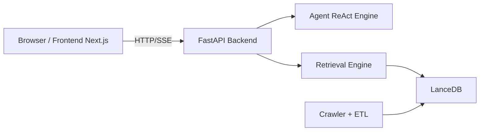

# SEU-WuHub

> 基于多源数据整合的智能信息服务系统

[中文](README.md) | [English](README.en.md)

<p align="center">
  
</p>

[](backend/pyproject.toml)
[](backend/pyproject.toml)
[](frontend/package.json)
[](frontend/package.json)
[](backend/pyproject.toml)
[](backend/pyproject.toml)
[](docs/ARCHITECTURE.md)
[](docs/backend/api.md)

SEU-WuHub 面向高校师生，聚合教务处、图书馆等多来源通知公告，通过混合检索与 ReAct Agent 提供自然语言问答能力。

## 功能亮点

- 多源信息采集：配置化爬虫，新增站点以 YAML 配置为主。
- 混合检索：向量检索 + 全文检索融合，兼顾语义与关键词。
- Agent 问答：ReAct 范式，支持工具调用与流式回答。
- SSE 流式体验：前端实时展示推理与回答过程。
- 统一存储：LanceDB 同时承载结构化数据、向量索引、全文索引。

## 架构概览



- 详细架构说明：[docs/ARCHITECTURE.md](docs/ARCHITECTURE.md)
- 技术叙事报告：[docs/TECHNICAL_NARRATIVE.md](docs/TECHNICAL_NARRATIVE.md)
- 模块集成说明：[docs/MODULE_INTEGRATION.md](docs/MODULE_INTEGRATION.md)

## 项目结构

```text
SEU-WuHub/
├── backend/      # FastAPI + Agent + Retrieval + Ingestion
├── frontend/     # Next.js App Router 前端
├── config/       # 全局配置（标签、站点等）
├── docs/         # 架构与模块文档
├── scripts/      # 运维与启动脚本
├── data/         # LanceDB 数据目录
└── docker-compose.yml
```

## 快速开始

### 1. 环境要求

- Python 3.13+
- Node.js 22+
- Docker / Docker Compose（可选）
- 建议安装 [uv](https://docs.astral.sh/uv/)

### 2. 本地开发（推荐）

1. 安装后端依赖

```bash
make backend-install
```

2. 安装前端依赖

```bash
make frontend-install
```

3. 启动后端（默认 8000）

```bash
make backend-dev
```

4. 启动前端（默认 3000）

```bash
make frontend-dev
```

访问地址：

- 前端：http://localhost:3000
- 后端：http://localhost:8000
- OpenAPI：http://localhost:8000/docs

### 3. Docker 一键启动

```bash
make docker-up
```

停止服务：

```bash
make docker-down
```

## 常用命令

```bash
# 代码质量
make lint
make format
make typecheck
make security

# 测试
make backend-test
make frontend-test
make test
```

## API 概览

主要接口（以实际代码为准）：

- `GET /api/v1/articles`
- `GET /api/v1/articles/{id}`
- `GET /api/v1/search`
- `POST /api/v1/search`
- `GET /api/v1/metadata`
- `POST /api/v1/chat/stream`
- `POST /api/v1/chat/title`
- `GET /health`

详细说明：

- [docs/backend/api.md](docs/backend/api.md)
- [backend/app/main.py](backend/app/main.py)

## 数据与检索

- 数据库路径：`data/lancedb`（容器内映射）
- 检索模式：向量检索 + 全文检索（融合）
- 关键模块：
  - [backend/retrieval/engine.py](backend/retrieval/engine.py)
  - [backend/retrieval/store.py](backend/retrieval/store.py)
  - [backend/ingestion/pipeline.py](backend/ingestion/pipeline.py)

## 文档导航

- 架构文档：[docs/ARCHITECTURE.md](docs/ARCHITECTURE.md)
- 部署文档：[docs/DEPLOYMENT.md](docs/DEPLOYMENT.md)
- 模块集成：[docs/MODULE_INTEGRATION.md](docs/MODULE_INTEGRATION.md)
- 技术报告：[docs/TECHNICAL_NARRATIVE.md](docs/TECHNICAL_NARRATIVE.md)

## 贡献指南

欢迎通过 Issue / PR 参与改进。

1. Fork 本仓库并创建特性分支。
2. 提交前执行 `make lint && make test`。
3. 在 PR 中说明改动背景、方案和验证结果，保持文档与实现同步更新。

## 许可证

本项目采用 MIT License（当前可参考 [backend/pyproject.toml](backend/pyproject.toml) 中的 license 字段）。
